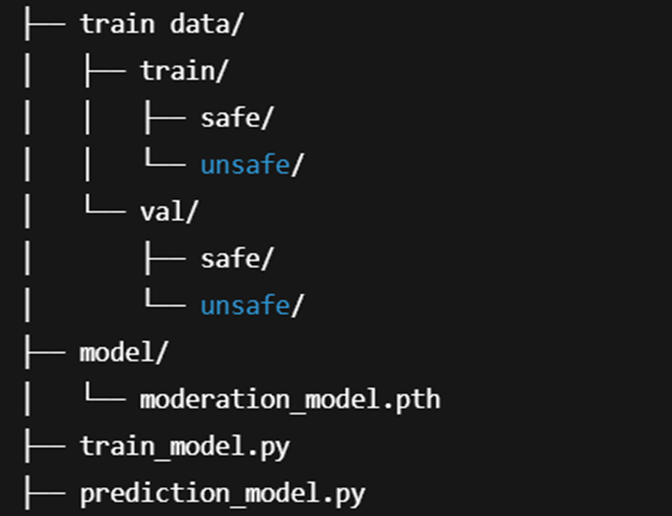

****Image Content Moderation using Deep Learning****

**Overview**

This repo  aims to automatically classify images as Safe or Unsafe using a deep learning-based image moderation model.
The model was trained on a large dataset of labeled images with an emphasis on detecting NSFW (Not Safe For Work) or unsafe content.

**Project Structure**

This is how the folder structure looks like

**Setup Instructions**

 1. Clone the Repo

        git clone https://github.com/Jishnu-exe/Content-Moderation.git

        cd image-content-moderation

2. Install dependencies

        pip install torch,torchvision,opencv-python torchvision, Pillow, numpy

3. Dataset Preparation

    Split your images into train/ and val/ folders with two subfolders in each:

    •	safe/
    •	unsafe/

    Make sure that images are split into 80% to 20% ratio for train and validation respectively. And both safe and unsafe images are equal to prevent any overfitting or underfitting the model.

4. Train the Model

        python train_model.py
    
    This will save moderation_model.pth inside the model/ directory.

5. Test the Model

    Use the prediction_model.py script to test the model on any image:

        python prediction_model.py

    If unsafe content is detected, a red box and label will be drawn on the image, mentions if its either safe or unsafe, shows the confidence of the prediction and also displays the confidence output on the terminal.

 

